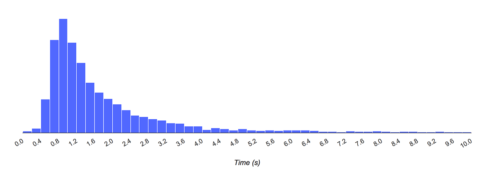

您可能已无数次听人提及性能的重要性，以及网页应用的运行速度十分关键。

但是，当您尝试回答“我的应用有多快？”这个问题时，您就会意识到，“快”是一个很模糊的概念。 我们所谓的“快”究竟是指什么？其情境为何？ 为谁提供高速度？

<iframe width="532" height="299" src="https://www.youtube.com/embed/6Ljq-Jn-EgU" frameborder="0" allow="accelerometer; autoplay; encrypted-media; gyroscope; picture-in-picture" allowfullscreen></iframe>

讨论性能时务求精确，以免产生误解或散布谬见，从而导致出于善意的开发者朝着错误的方向优化，最终影响而非改善用户体验。

例如，我们现在常常听到人们这样说：我已经测试我的应用，加载时间为 X.XX 秒。



这种陈述的问题并不在于不真实，而在于扭曲事实。 **加载时间会因为用户不同而有很大的变化，具体取决于用户的设备功能以及网络状况。 以单个数字的形式呈现加载时间忽略了遭遇过长加载时间的用户**。

实际上，您应用的加载时间是每个用户所有加载时间的汇总，而全面表示加载时间的唯一方法是使用以下直方图所示的分布方法：

X 轴上的数字显示加载时间，而 Y 轴上条的高度显示体验到特定时间段中加载时间的用户相对数量。 正如此图表所示，虽然最大的用户群体验到的加载时间不到 1 或 2 秒，但仍有很多用户体验到相当长的加载时间。

之所以说“我网站的加载时间为 X.XX 秒”是谬见的另一个原因是，加载并非单一的时刻，而是一种任何单一指标都无法全面衡量的体验。 在加载过程中，有多个时刻都会影响到用户对速度的感知，如果只关注其中某个时刻，就可能会遗漏其余时间内用户感受到的不良体验。

例如，假定某应用针对快速初始渲染进行优化，以便立刻将内容传递给用户。 然后，如果该应用加载一个需要花费数秒来解析和执行的大型 JavaScript 软件包，那么只有在 JavaScript 运行之后，页面上的内容才可供交互。

如果用户可以看到页面上的链接但无法点击，或者可以看到文本框但无法在其中输入内容，他们可能就不会关心页面渲染的速度有多快。

因此，**我们不应该只使用一个指标来衡量加载，而应该衡量整个体验过程中可能影响用户对加载的感知的每个时刻**。

性能谬见的另一个示例是性能只是加载时间的问题。

作为一个团队，我们对曾经犯过这个错感到内疚，而大部分性能工具仅衡量加载性能也会将这个错误放大。

但事实是，随时都有可能发生性能不佳的情况，不只限于加载期间。 应用无法迅速响应点按或点击操作，以及无法平滑滚动或产生动画效果的问题与加载缓慢一样，都会导致糟糕的用户体验。 用户关心的是总体体验，我们开发者也应如此。

所有这些性能误解有一个共同的主题，即开发者都将注意力集中在对于用户体验帮助不大甚至全无帮助的事情上。 同样地，加载时间或 DOMContentLoaded 时间等传统性能指标极不可靠，因为加载发生的时间可能与用户认为的应用加载时间对应，也可能不对应。

因此，为确保不重复这个错误，我们必须回答下列问题：

**1.哪些指标能够最准确地衡量人所感受到的性能？**

**2.如何针对实际用户来衡量这些指标？**

**3.如何解读衡量结果以确定应用是否“速度快”？**

**4.了解应用的实际用户性能之后，如何避免性能下降并在未来提高性能？**

## 以用户为中心的性能指标

当用户导航到网页时，通常会寻找视觉反馈，以确信一切符合预期。


|是否发生？|	导航是否成功启动？服务器是否有响应？|
|:-:|---|
|是否有用？|	是否已渲染可以与用户互动的足够内容？|
|是否可用？|	用户可以与页面交互，还是页面仍在忙于加载？|
|是否令人愉快？|	交互是否顺畅而自然，没有滞后和卡顿？|

为了解页面何时为用户提供这样的反馈，我们定义了多个新指标：

### 首次绘制与首次内容绘制

[Paint Timing API](https://github.com/WICG/paint-timing) 定义两个指标：首次绘制 (FP) 和 首次内容绘制 (FCP)。 这些指标用于标记导航之后浏览器在屏幕上渲染像素的时间点。 这对于用户来说十分重要，因为它回答了以下问题： 是否发生？

这两个指标之间的主要差别在于，FP 标记浏览器渲染任何在视觉上不同于导航前屏幕内容之内容的时间点。 相比而言，FCP 标记的是浏览器渲染来自 DOM 第一位内容的时间点，该内容可能是文本、图像、SVG 甚至 ```<canvas>``` 元素。

### 首次有效绘制和主角元素计时

首次有效绘制 (FMP) 指标能够回答“是否有用？”这一问题。 虽然“有用”这一概念很难以通用于所有网页的方式规范化（因此尚不存在任何规范），但是网页开发者自己很清楚其页面的哪些部分对用户最为有用。


网页的这些“最重要部分”通常称为主角元素。 例如，在 YouTube 观看页面上，主视频就是主角元素。 在 Twitter 上，主角元素可能是通知标志和第一篇推文。 在天气应用上，主角元素是指定地点的天气预测。 在新闻网站上，主角元素可能是重大新闻和置顶大图。

在网页上，几乎总有一部分内容比其他部分更重要。 如果页面最重要的部分能迅速加载，用户可能不会注意到其余部分是否加载。